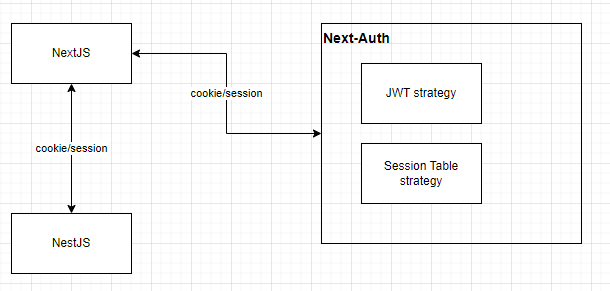

# Next-auth.js module for Nest framework (node.js)

```
npm install @nest-hero/next-auth
```

## NextAuth side
```typescript
export const authOptions: NextAuthOptions = {
    session: {
        strategy: 'jwt',
    }
}
```

## NestJS side

```typescript
import {NextAuthModule} from '@nest-hero/next-auth';

@Module({
    imports: [
        NextAuthModule.forRoot({
            secret: process.env.NEXTAUTH_SECRET,
            cookieName: 'optional'
        }),
    ],
})
export class AppModule {}
```
```typescript
import { NextAuthGuard, User } from '@nest-hero/next-auth';

@Controller()
export class AppController {

    @UseGuards(NextAuthGuard)
    @Post('/')
    handler(@User() user) {
        return user;
    }
}
```
## Diagram


You can check full example (Nest.JS + Next.JS) at `/exmaple` folder

# Roadmap
- [x] NextAuth jwt strategy
- [ ] NextAuth Options Wrapper
- [ ] NextAuth session table strategy
